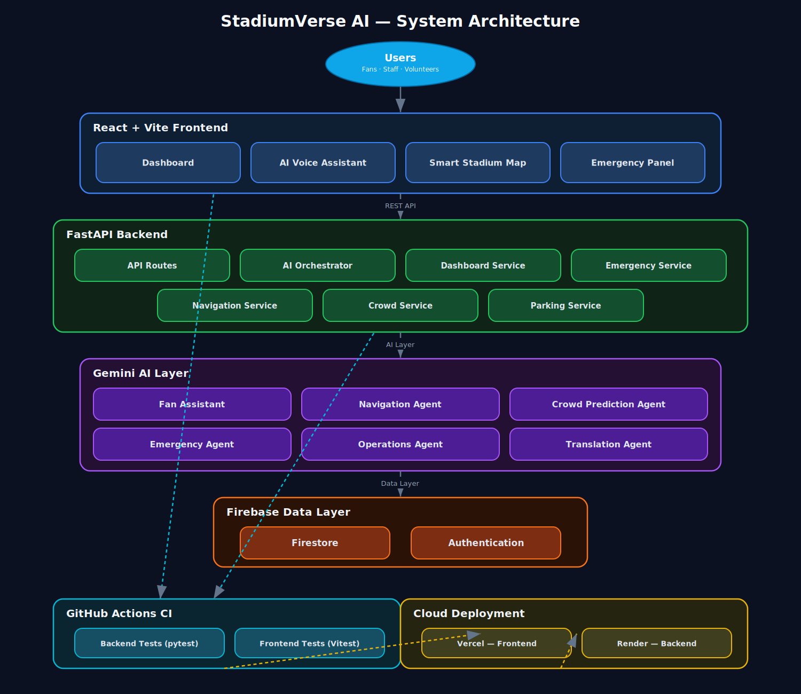
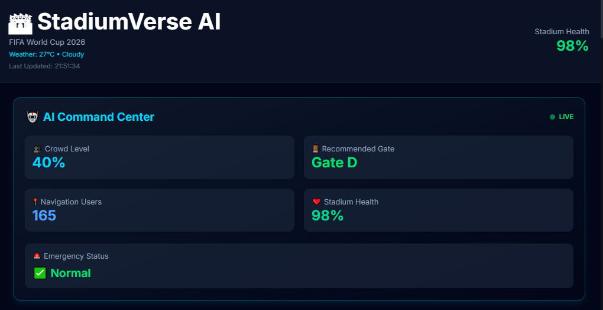
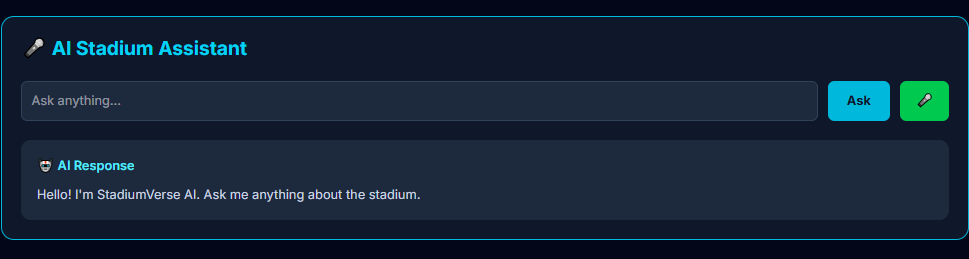
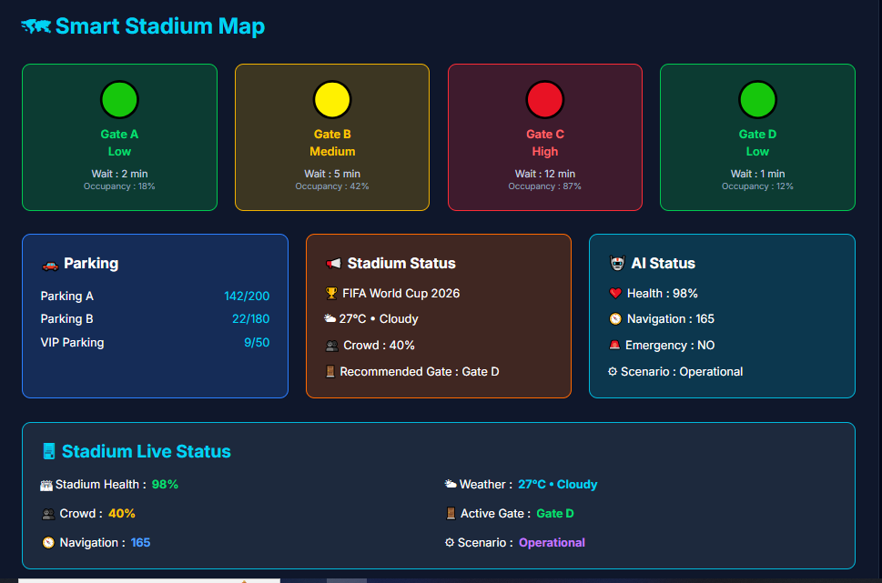
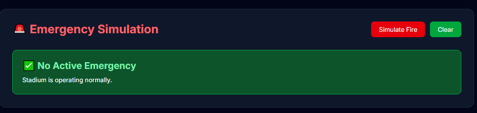
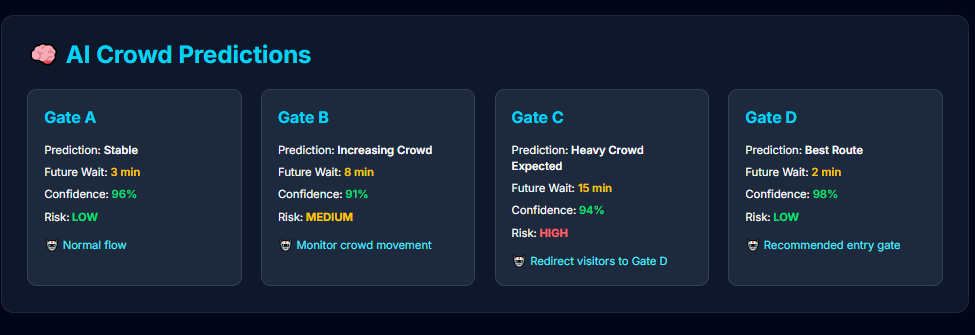

# 🏟 StadiumVerse AI

> **The AI Operating System for Smart Stadiums**  
> **FIFA World Cup 2026 | GenAI Hackathon Project**


---

# 🌍 Live Demo

### 🚀 Frontend

👉 https://stadiumverse-ai-alpha.vercel.app

### ⚙ Backend API

👉 https://stadiumverse-ai.onrender.com

### 💻 GitHub Repository

👉 https://github.com/souvikpal77/stadiumverse-ai

---

# 📖 Overview

StadiumVerse AI is a next-generation AI-powered Smart Stadium Operating System built for the FIFA World Cup 2026 GenAI Hackathon.

The platform combines **Generative AI**, **real-time analytics**, **predictive intelligence**, and **multi-agent collaboration** to improve stadium operations, crowd safety, fan engagement, navigation, and emergency management.

Instead of functioning as a traditional chatbot, StadiumVerse AI acts as an intelligent operating system where specialized AI agents work together to assist fans, volunteers, organizers, and stadium operators in real time.

---

# 🚀 Project Highlights

- 🤖 Multi-Agent AI Architecture
- 🏟 AI-Powered Stadium Operations
- 🚶 Smart Indoor Navigation
- 📊 Crowd Prediction Engine
- 🚨 Emergency Response System
- 🌐 Gemini AI Integration
- ☁ Cloud-Native Deployment
- ⚡ Automated CI/CD using GitHub Actions

---

# ✨ Key Features

## 🤖 AI Fan Assistant

Gemini-powered conversational assistant that answers stadium-related questions using natural language.

---

## 🏟 Smart Stadium Dashboard

Live operational monitoring including

- Crowd Density
- Parking Availability
- Weather
- Stadium Health
- Active Alerts
- Recommended Entry Gate

---

## 🚶 Smart Navigation

- AI Gate Recommendation
- Crowd-aware Routing
- Indoor Navigation
- Shortest Waiting Time Prediction

---

## 📊 Crowd Prediction

Uses AI to predict crowd congestion and proactively recommend safer entry gates.

---

## 🚨 Emergency Management

Supports

- Live Emergency Alerts
- Incident Monitoring
- AI Evacuation Recommendations
- Dynamic Gate Rerouting

---

## 🌐 Multi-Agent AI

Dedicated AI agents for

- 🎫 Fan Assistant
- 🧭 Navigation
- 👥 Crowd Intelligence
- 🚨 Emergency Response
- 🙋 Volunteer Assistance
- 🌍 Translation
- ⚙ Stadium Operations

---

## ☁ Cloud Deployment

- Frontend → Vercel
- Backend → Render
- Automated CI → GitHub Actions

---

# 🏗 System Architecture

StadiumVerse AI follows a modular multi-layer architecture designed for intelligent stadium operations.

<p align="center">
  
</p>

### Architecture Layers

### 🎨 Frontend

- React + Vite
- Dashboard
- AI Voice Assistant
- Smart Stadium Map
- Emergency Panel

### ⚙ Backend

- FastAPI REST APIs
- Dashboard Service
- Crowd Service
- Navigation Service
- Parking Service
- Emergency Service

### 🤖 AI Layer

Gemini-powered Multi-Agent System

- Fan Assistant
- Navigation Agent
- Crowd Prediction Agent
- Emergency Agent
- Translation Agent
- Operations Agent

### ☁ Data Layer

- Firebase Firestore
- Firebase Authentication

### 🚀 Deployment

- Vercel
- Render
- GitHub Actions

For more information:

📘 docs/architecture.md

---

# 🛠 Technology Stack

## Frontend

- React
- TypeScript
- Vite
- Tailwind CSS
- Vitest

## Backend

- FastAPI
- Python 3.12
- Gemini AI
- Firebase
- REST APIs
- Pytest

## DevOps

- GitHub Actions
- Render
- Vercel
- Git

---

# 🤖 AI Agents

| Agent | Responsibility |
|--------|----------------|
| 🎫 Fan Assistant | Stadium FAQs & Fan Support |
| 🧭 Navigation Agent | Indoor Navigation |
| 👥 Crowd Agent | Crowd Monitoring |
| 🚨 Emergency Agent | Emergency Response |
| 🙋 Volunteer Agent | Volunteer Assistance |
| 🌍 Translation Agent | Multi-language Support |
| ⚙ Operations Agent | Stadium Operations |

---

# 📂 Project Structure

```text
stadiumverse-ai/
│
├── backend/
│   ├── app/
│   ├── prompts/
│   ├── tests/
│   └── requirements.txt
│
├── frontend/
│   ├── src/
│   ├── tests/
│   └── package.json
│
├── docs/
│   ├── architecture.md
│   ├── architecture.png
│   ├── api.md
│   ├── ai-modules.md
│   └── deployment.md
│
├── .github/
│   └── workflows/
│       └── ci.yml
│
├── LICENSE
└── README.md
```

---

# 🚀 Quick Start

## Backend

```bash
cd backend

python -m venv venv

# Windows
venv\Scripts\activate

pip install -r requirements.txt

copy .env.example .env

uvicorn app.main:app --reload --port 8000
```

Swagger API

```
http://localhost:8000/docs
```

---

## Frontend

```bash
cd frontend

npm install

copy .env.example .env

npm run dev
```

Frontend

```
http://localhost:5173
```

---

# 🔑 Environment Variables

## Backend

```env
GEMINI_API_KEY=

FIREBASE_CREDENTIALS_PATH=
```

## Frontend

```env
VITE_FIREBASE_API_KEY=

VITE_FIREBASE_AUTH_DOMAIN=

VITE_FIREBASE_PROJECT_ID=

VITE_FIREBASE_STORAGE_BUCKET=

VITE_FIREBASE_MESSAGING_SENDER_ID=

VITE_FIREBASE_APP_ID=
```

---

# 🧪 Testing

## Backend

```bash
pytest
```

✅ Backend tested using Pytest

---

## Frontend

```bash
npm run test
```

✅ Frontend tested using Vitest

---

## Continuous Integration

Every push automatically runs

- ✅ Backend Tests
- ✅ Frontend Tests
- ✅ GitHub Actions CI

---

# 📚 Documentation

- 📘 [Architecture](docs/architecture.md)
- 📙 [API Documentation](docs/api.md)
- 📗 [AI Modules](docs/ai-modules.md)
- 📕 [Deployment Guide](docs/deployment.md)

---

# 📸 Application Screenshots

### 🏟 Smart Stadium Dashboard



---

### 🤖 AI Voice Assistant



---

### 🗺 Smart Stadium Map



---

### 🚨 Emergency Simulation



---

### 👥 Crowd Prediction & Gate Recommendation



---

# 🔮 Future Enhancements

- AI CCTV Anomaly Detection
- Indoor AR Navigation
- IoT Sensor Integration
- Predictive Maintenance
- Seat Recommendation Engine
- Digital Twin Stadium Simulation

---

# 👨‍💻 Developer

**Souvik Pal**

B.Tech CSE (IoT, Cybersecurity & Blockchain)

Institute of Engineering & Management, Kolkata

🔗 GitHub  
https://github.com/souvikpal77

💼 LinkedIn  
https://www.linkedin.com/in/souvik-pal-182453388

---

# 📜 License

This project is licensed under the **MIT License**.