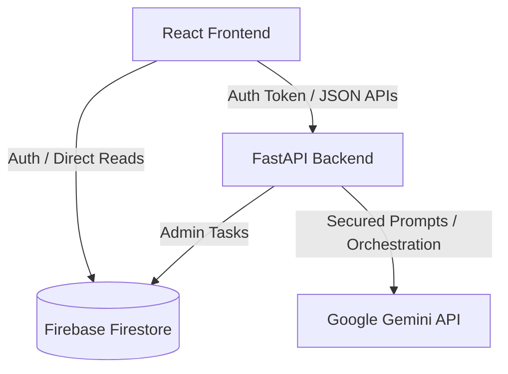

# Architecture & System Design

This document details the architectural foundation, data flow models, and security principles for the StadiumVerse AI system.

## 1. System Overview

StadiumVerse AI is structured as a decoupled full-stack application leveraging:
- **React Frontend**: A highly responsive client application built with Vite and TypeScript.
- **FastAPI Backend**: A high-performance Python ASGI backend serving REST endpoints.
- **Google Gemini API**: Integrated server-side via the `google-generativeai` library to power LLM tasks.
- **Firebase Firestore**: A serverless, document-oriented NoSQL database used as the primary data store.
- **Firebase Auth**: User identity management and access control.

## 2. Core Architectural Principles

### Unidirectional AI API Integration
To protect proprietary prompts, API keys, and model parameters, **the frontend is prohibited from interacting directly with the Gemini API**. 
- All AI queries, chat requests, and cognitive routines are initiated by the frontend sending structured HTTP payloads to the FastAPI backend.
- The FastAPI backend validates the requests, appends system instructions/prompt templates, contacts the Gemini API, parses the response, and forwards the output to the client.

### Firebase Firestore Database
- **Primary Database**: Firebase Firestore is used for storing stadium states, logs, volunteer registries, navigation routes, and chat history collections.
- **Serverless Scaling**: Client-side queries can read records (using Firebase Security Rules) to keep interfaces fast, while write operations go through backend routes to enforce validations and orchestrate agent tasks.

## 3. Communication Patterns

- **RESTful Endpoints**: Used for CRUD operations, status queries, and invoking cognitive tasks from the AI layer.
- **Server-Sent Events (SSE) / WebSockets (Future Extension)**: Configured in routers for streaming model outputs from Gemini when low-latency text generation is required.
